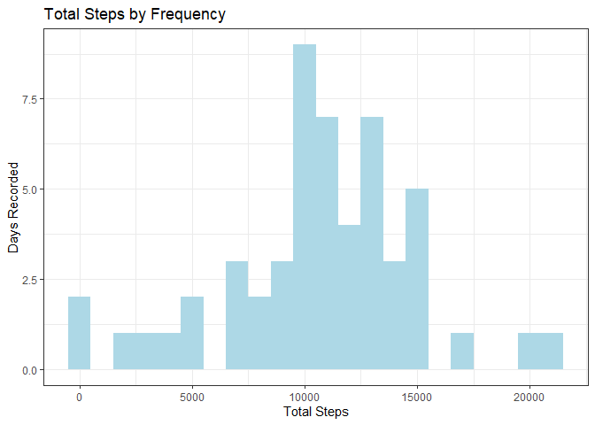
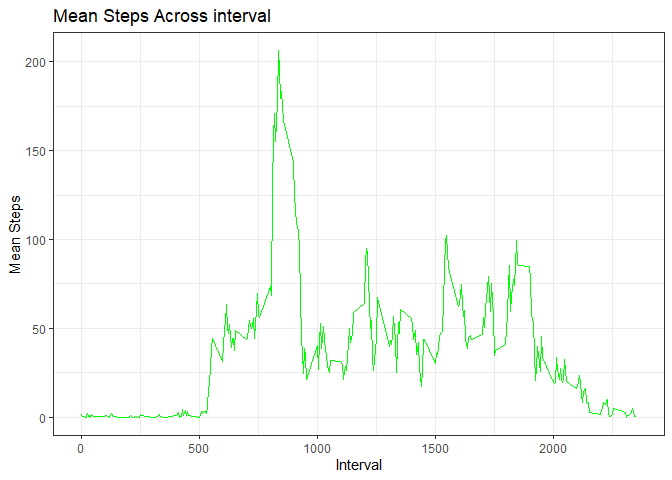
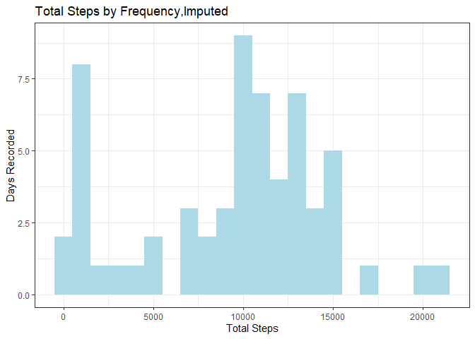
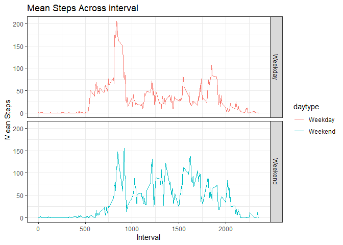

    
---
title: "Reproducible Research: Peer Assessment 1"
output: 
  html_document:
    keep_md: true
---

The following document looks at activity data from a test subject wearing a personal monitoring device.  The data was downloaded from [cloudfront](https://d396qusza40orc.cloudfront.net/repdata%2Fdata%2Factivity.zip) on August 13, 2019. Summary statistics and plots were calculated from the dataset.  

## Loading and preprocessing the data


```r
### Load packages
library(dplyr)
library(ggplot2)
library(readr)

### Read in datafile
df <- read.csv("activity.csv", na.strings = "NA")

### Group data by date
dfGrouped <- group_by(df, date)
```

## What is mean total number of steps taken per day?  
### 1. Calculate the total number of steps taken per day

```r
### Create summary dataset
dfSummary <- summarize(dfGrouped, total.steps = sum(steps, na.rm = TRUE))
head(dfSummary)
```

```
## # A tibble: 6 x 2
##   date       total.steps
##   <fct>            <int>
## 1 2012-10-01           0
## 2 2012-10-02         126
## 3 2012-10-03       11352
## 4 2012-10-04       12116
## 5 2012-10-05       13294
## 6 2012-10-06       15420
```

The first first rows of the calculation are given above.  

### 2. Make a histogram of the total number of steps taken each day

```r
histSteps <- ggplot(data = dfSummary, aes(total.steps)) + 
        geom_histogram(fill = "lightblue", binwidth = 1000) +
        labs(x = "Total Steps", y = "Days Recorded", title = "Total Steps by Frequency") + 
        theme_bw()
print(histSteps)
```

<!-- -->

The first bin (0 to 1000 steps) has the highest frequency of total steps.  

### 3. Calculate and report the mean and median of the total number of steps taken per day

```r
### Mean and median total steps per day
meanmed <- summarize(df, mean = mean(steps, na.rm = TRUE), median = median(steps, na.rm = TRUE))
print(meanmed)
```

```
##      mean median
## 1 37.3826      0
```

Unsurprisingly, given the previous data, the median number of steps is 0.

## What is the average daily activity pattern?  
### 1. Make a time series plot of the 5-minute interval (x-axis) and the average number of steps taken, averaged across all days (y-axis)


```r
## Create summary dataset
dfGrouped2 <- group_by(df, interval)
dfSummary2 <- summarize(dfGrouped2, mean = mean(steps, na.rm = TRUE))

### Line graph of mean of steps taken across all days
avgSteps <- ggplot(data = dfSummary2, aes(interval, mean)) + 
        geom_line(color = "green") +
        labs(x = "Interval", y = "Mean Steps", title = "Mean Steps Across interval") + 
        theme_bw()
print(avgSteps)
```

<!-- -->

The daily pattern spikes at around interval = 800, at around 200 steps per interval. It then falls off throughout the day. We can find the exact value below.  

### 2. Which 5-minute interval, on average across all the days in the dataset, contains the maximum number of steps?


```r
### Calculate interval on average which has maximum number of steps
dfSummary2$interval[dfSummary2$mean == max(dfSummary2$mean)]
```

```
## [1] 835
```

## Imputing missing values 

### 1. Calculate and report the total number of missing values in the dataset (i.e. the total number of rows with NAs)

```r
sum(!complete.cases(df))
```

```
## [1] 2304
```

### 2. Devise a strategy for filling in all of the missing values in the dataset. The strategy does not need to be sophisticated. For example, you could use the mean/median for that day, or the mean for that 5-minute interval, etc  

The strategy I've chosen is to impute the data with the median of each interval.  

### 3. Create a new dataset that is equal to the original dataset but with the missing data filled in.


```r
### Imputing data with median of interval
dfImputed <- mutate(dfGrouped2, steps = replace(steps, is.na(steps), median(steps, 
        na.rm = TRUE)))
dfImputedSum <- dfImputed %>% ungroup() %>% group_by(date) %>% summarize(total.steps = 
        sum(steps, na.rm = TRUE))
head(dfImputedSum)
```

```
## # A tibble: 6 x 2
##   date       total.steps
##   <fct>            <int>
## 1 2012-10-01        1141
## 2 2012-10-02         126
## 3 2012-10-03       11352
## 4 2012-10-04       12116
## 5 2012-10-05       13294
## 6 2012-10-06       15420
```

The new dataset is "dfImputedSum," as given above.  

### 4. Make a histogram of the total number of steps taken each day and Calculate and report the mean and median total number of steps taken per day. Do these values differ from the estimates from the first part of the assignment? What is the impact of imputing missing data on the estimates of the total daily number of steps?  

First, make the histogram.


```r
histStepsImp <- ggplot(data = dfImputedSum, aes(total.steps)) + 
        geom_histogram(fill = "lightblue", binwidth = 1000) +
        labs(x = "Total Steps", y = "Days Recorded", 
        title = "Total Steps by Frequency,Imputed") + 
        theme_bw()
print(histStepsImp)
```

<!-- -->

Next, find the median and mean of the total steps taken per day.

```r
### Mean and median total steps per day (Imputed)
meanmedImp <- summarize(ungroup(dfImputed), mean = mean(steps, na.rm = TRUE), median = median(steps, na.rm = TRUE))

### Compare mean and median against imputed and as-is dataset
meanmedOvr <- bind_cols(Type = c("As-is", "Imputed"), bind_rows(meanmed, meanmedImp))
print(meanmedOvr)
```

```
## # A tibble: 2 x 3
##   Type     mean median
##   <chr>   <dbl>  <dbl>
## 1 As-is    37.4      0
## 2 Imputed  33.0      0
```

Yes, substituting missing values with the median of 0 unsuprisingly reduces the mean of the dataset. Median stays at 0.  

## Are there differences in activity patterns between weekdays and weekends?  

### 1. Create a new factor variable in the dataset with two levels – “weekday” and “weekend” indicating whether a given date is a weekday or weekend day


```r
## Converting date column to date format and parsing day of week
dfImputed$date <- parse_date(as.character(dfImputed$date))
dfImputed$dayofweek <- weekdays(dfImputed$date)
dfImputed <- dfImputed %>% mutate(daytype = ifelse(dayofweek == "Saturday" | 
        dayofweek == "Sunday", "Weekend","Weekday")) %>% group_by(interval, daytype)
dfSummaryImpDow <- summarize(dfImputed, mean = mean(steps, na.rm = TRUE))
head(dfSummaryImpDow)
```

```
## # A tibble: 6 x 3
## # Groups:   interval [3]
##   interval daytype  mean
##      <int> <chr>   <dbl>
## 1        0 Weekday 2.02 
## 2        0 Weekend 0    
## 3        5 Weekday 0.4  
## 4        5 Weekend 0    
## 5       10 Weekday 0.156
## 6       10 Weekend 0
```

See above. "dfSummaryImpDow" is the summary of the imputed data with weekday/weekend tags.  

### 2. Make a panel plot containing a time series plot of the 5-minute interval (x-axis) and the average number of steps taken, averaged across all weekday days or weekend days (y-axis). See the README file in the GitHub repository to see an example of what this plot should look like using simulated data.


```r
### Line graph of mean of steps taken across days of week
avgStepsDow <- ggplot(data = dfSummaryImpDow, aes(interval, mean)) + 
        geom_line(aes(color = daytype)) +
        labs(x = "Interval", y = "Mean Steps", title = "Mean Steps Across interval") + 
        facet_grid(daytype~.) +        
        theme_bw()
print(avgStepsDow)
```

<!-- -->
